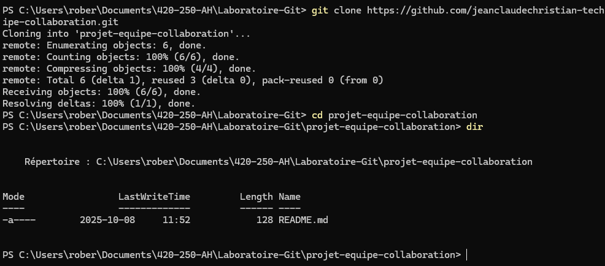
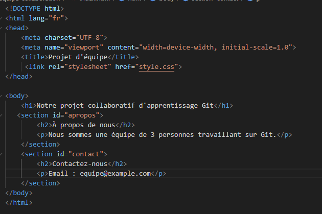

# Rapport de laboratoire Git - Équipe [Kouassi]

## 1. Membres de l'équipe
- Membre 1 : [Christian, Jean Claude - Chef d'équipe]
- Membre 2 : [Nanou Ange Robert, Kouassi - Développeur]
- Membre 3 : [Kimou Ossei Elise Tresor - Testeur]

## 2. Résumé des parties complétées

### Partie 1 : Configuration initiale
Mon compte GitHub personnel a été créé et vérifié pour permettre la collaboration.

### Partie 2 : Ajout des collaborateurs
J’ai accepté l’invitation,rejoint le projet sur GitHub et cloné le dépôt sur mon ordinateur avec git clone.

### Partie 3 : Première collaboration
j’ai récupéré les informations du membre1, j'ai fait mon fichier membre2.txt contenant mes informations et fait un git add, git commit, puis git push.

### Partie 4 : Résolution de conflits
Un conflit est apparu lorsque j’ai modifié le fichier README sans faire de git pull.
J’ai résolu le conflit en gardant les deux sections (Chef d’équipe et Développeur).

### Partie 5 : Collaboration HTML
J’ai ajouté la section “À propos” dans le fichier index.html et vérifié le résultat dans le navigateur.

### Partie 6 : Utilisation des branches
Christian le membre1 a créé une branche ajout-style. Après la fusion, nous avons récupéré les changements et vu la page stylisée.

### Partie 7 : Situations réalistes
Nous avons testé différentes situations (modifications simultanées, conflits, annulation de commit) et observé les effets dans l’historique Git avec git log.

## 3. Captures d’écran – Membre 1 (Chef d’équipe)

### Étape 1.2 – Création du compte GitHub

### Étape 1.3 – Connexion du dépôt local au dépôt distant

### Étape 2.1 – Ajout des collaborateurs et clonage du projet

### Étape 3.1 – Création de fichiers par les différents membres

### Étape 5.1 – Ajout du fichier HTML principal

### Étape 6.1 – Ajout du style CSS et travail sur les branches

### Étape 7.1 – Résolution de conflit et validation finale

### Étape 7.2 – Historique et finalisation du projet

## 3. Captures d'écran - Membre 2 (Développeur)

### Étape 1.1 - Initialisation du dépôt

### Étape 1.2 - Création du compte GitHub

### Étape 2.2 : Acceptation de l'invitation et clonage du projet

### Étape 3.1 : Création de fichiers par différents membres

### Étape 4.1 : Création volontaire d'un conflit

### Étape 4.2 : Résolution du conflit

### Étape 5.2 : Ajout de sections par chaque membre

### Partie 7 : Situations réalistes de collaboration

## 3. Captures d’écran – Membre 3 (Testeur)
### Étape 1.2 - Création du compte GitHub

### Étape 2.2 – Acceptation de l'invitation et clonage du projet

### Étape 3.1 – Création de fichiers par différents membres

### Étape 5.2 – Ajout de sections par chaque membre

### Étape 5.3 – Conflit sur le fichier HTML

## 4. Difficultés rencontrées

### Difficulté 1
- **Problème** : Lors d’un git push, j’ai eu un message d’erreur disant que je devais d’abord faire un git pull.
- **Solution** : J’ai compris que quelqu’un de l’équipe avait déjà envoyé des changements sur GitHub.
J’ai donc fait un git pull pour récupérer les nouvelles versions, puis j’ai refait mon git push.
Après cette erreur, j’ai pris l’habitude de toujours faire un git pull avant de commencer à travailler.

### Difficulté 2
- **Problème** : Lors d’un git pull, j'avais du mal à récuperer des informations des membres de l'équipe dans certains cas. Aussi,j'ai eu du mal à push certaines informations parce que cela créait du conflit
- **Solution** : j'ai forcé certains pull et certains push et j'ai du faire des commit pour gérer certaines  situations de conflits en gardant toutes les modifications

## 5. Apprentissages
-J’ai appris à utiliser les commandes de base comme git init, git remote add origin, git push et git pull.
### Ce que nous avons appris sur Git
- [Apprentissage 1 : J’ai compris comment fonctionne le travail d’équipe avec Git.
Chaque membre fait ses modifications localement, puis les envoie au dépôt distant.
Il faut bien se synchroniser pour éviter les erreurs.]
- [Apprentissage 2 : J’ai appris à résoudre calmement des conflits dans différente situation]
- [Apprentissage 3 : J’ai vu que créer une branche permet de travailler sur une nouvelle fonctionnalité sans toucher au code principal.
]

### Ce que nous avons appris sur le travail d'équipe
- [Apprentissage 1 : j'ai appris qu'il faut travailler en équipes avec une communications claires pour que tous le monde sache quoi faire, ou est ce que l'équipe est rendu]
- [Apprentissage 2 : J’ai compris qu’il faut écrire des messages clairs, comme “Ajout de la section À propos” ou “Correction du conflit README”, pour que l’historique soit facile à suivre pour tous les membres de l'équipe]
## 6. Conclusion
En résumé, ce laboratoire m’a vraiment aidé à comprendre le travail collaboratif avec Git et GitHub.
J’ai appris à mieux m’organiser, à communiquer avec mes coéquipiers, et à utiliser les bonnes commandes au bon moment.
Ce qui m’a le plus marqué, c’est la résolution des conflits qui est compliqué au début.Mais plus on n'avancais dans le travail mieux ont n'arrivaient à gérer certains conflits, car ce sont des situations qu’ont peut vivre souvent dans un vrai projet.Aussi, cela m'a permis de voir l’importance de bien suivre les étapes et de rester attentif à ce que les autres font dans le projet.